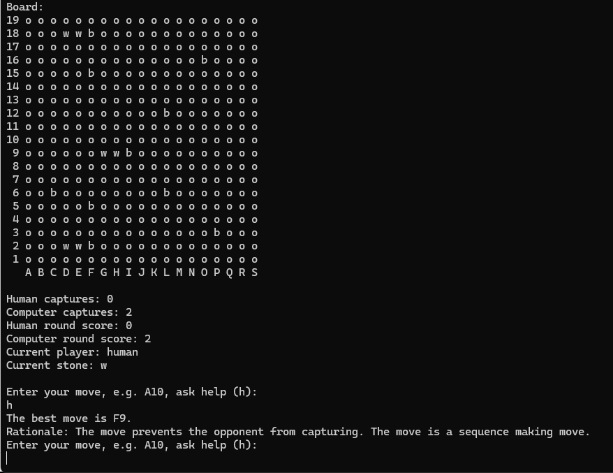

# Pente - Prolog

This project is a part of the CMPS 366, [Organization of Programming Languages](https://pages.ramapo.edu/~amruth/teaching/opl/f23/opl.html) (referred colloquially with a mixture of dread, resentment, and apprehension as "OPL"), course during Fall 2023 at Ramapo College of New Jersey. Considered as the most difficult class in the Computer Science curriculum at Ramapo, the class is taken typically during the senior year; I took this class during my sophomore year. The same game is implemented in four different programming languages that are based on different paradigms: C++ (structured and object-oriented), Lisp (functional), Java/Android (object-oriented and event-driven for the GUI), and Prolog (logic). This is the Prolog implementation of the game.

## Implementation in Other Paradigms

### [Structured & OOP - C++](https://github.com/bibhubhatta/cmps366-pente-cpp)

### [Functional - Lisp](https://github.com/bibhubhatta/cmps366-pente-lisp)

### [OOP & Event-Driven - Java/Android](https://github.com/bibhubhatta/cmps366-pente-java)

## Pente

Pente is a two-player board game that is played on a 19x19 board. The game is played with black and white stones. The objective of the game is to place five stones in a row, either horizontally, vertically, or diagonally. The game is played in turns, with each player placing one stone on the board per turn. The game ends when one player has five stones in a row, or when the board is full and no player has won. The player with five stones in a row wins the game.

## Requirements of the Project

### Objective

Win by placing at least five stones in an uninterrupted line or capturing five pairs of opponent's stones while scoring as many points as possible.

### Players

One human and one computer player, playing a tournament consisting of multiple rounds.

### Setup

19x19 board with intersections labeled by columns (A-S) and rows (1-19).

### First Player

Determined by a coin toss in the first round and by points in subsequent rounds.

### Turns

The first player places a white stone at the center (J10) on the first turn and another white stone at least 3 intersections away on the second turn. Players alternate turns thereafter.

### Capturing Stones

A player can capture a pair of opponent's stones if they place their stones on both sides of the opponent's stones in a row, column, or diagonal.

### End of Round

A round ends when a player places five stones in a row or captures five pairs of opponent's stones.

### Scoring

Points are awarded for placing five stones in a row, capturing pairs of opponent's stones, and placing four stones in a row.

### Tournament

The human player can choose to play another round or end the tournament. The winner is the player with the most points.

### Computer Strategy

The computer must have strategies for creating and countering initiatives.

### User Interface

Provide a user-friendly interface with ASCII graphics and command-line input. Validate all human inputs and display the computer's moves and strategies.

### Help Mode

The computer must provide recommendations for the human player's moves upon request.

### Serialization

Allow the game to be saved and resumed later by saving the current state to a text file.

More information of the project requirements can be found at [Professor Amruth Kumar's website](https://pages.ramapo.edu/~amruth/teaching/opl/projects/pente/problem.html).

## Extra Features

- The board can be resized into any length and width, even rectangles.
    All game logic and IO operations are compatible with different
    sizes.

- Test Driven Development - All predicates without IO are thoroughly
    tested with test code and hundred percent coverage.

# Description of Data Structures

## Board

A list of list of atoms – used to represent the board as defined in the
serialization files

## Game State

A list containing the board, scores, captures and the next player as
defined in the serialization field

## Position

A string representing the position in the board. Many predicates are
implemented to support coordinate geometry point operations such as
finding neighbors, rows, columns and diagonals

## List

All aggregate data types are list.

# Screenshots

## First player of the round being determined

## Computer’s move being explained

## Computer providing help

## Winner of the round being announced

## Winner of the tournament being announced

